## The project

### What is Instacart?

InstaCart is an american company which provide personal shopping services from different shops and retailers such as WholeFoods and Costco to its customers<a href="#note1" id="note1ref"><sup>1</sup></a>. People can order their groceries via the Instacart app and the website
https://www.instacart.com/ . After selecting products through the Instacart app, personal shoppers review your order and do the in-store shopping and delivery for you. 

### The problem
Instacart, same as other online shopping web sites, may like to suggest some new item to the customer. This suggestion information may include how many products and  what products a customer will be interested to order. This idea was come from a competition introduced orginally in the kaggle website in 2017 <a href="#note2" id="note2ref"><sup>2</sup></a>. 

## Recommendation system
It has worth to be mentioned that every customer has few orders while each order belongs to only one customer. This indicates that the problem is about predict the future customer orders rather than predicting products in each order. This is more like recommending products that you can see all in e-shopping website such as Amazon. The general method is called recommender system as part of information filtering system <a href="#note3" id="note3ref"><sup>3, </sup> </a><a href="#note4" id="note4ref"><sup>4</sup></a>. 

One of well-used recommendation system is collaborative filtering<a href="#note5" id="note5ref"><sup>5</sup></a>. This method is based on an assumption that users who have a taste will act according to other people with the same preference.  To explain it simpler, one may say products which have been purchased by a some people with a similar preference so far, are most likely to be ordered by other people who have similar opinion about products. 
More information can be found in [collaborative filtering wikipage](https://en.wikipedia.org/wiki/Collaborative_filtering). In this model we need to know the preference of the every customer or in other word how customer incline toward every product. In may websites like Netflix and  Amazon, people asked to put their review and their rating for the product they have used. These information will be used to recommend more product to customers based on their rating. 

:point_up:But there are some real problem, first of all every day there will be more new customers. These customers don't have any rating information in the dataset. Second, there are lots of products which people do not rate at all. Some people even do not rate anything even they have used them. In some cases, like here ( please check the [data](#Data) section), there is no information about customers preference at all, except people order history.  The lack of rating data can be rectified by implicit collaborative filtering. In this project I have used an approach from [Jesse Wood website](https://jessesw.com/Rec-System/). 

## Data

 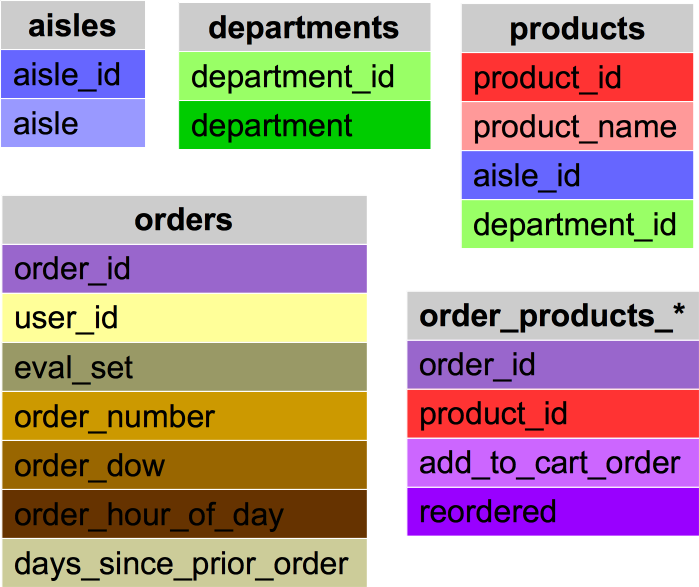

Original 7 files have been downoaded from [kaggle instacart competition website](https://www.kaggle.com/c/instacart-market-basket-analysis/data). The provided data included the history of customer purchases and information of products. Generally, the records of ordered have been grouped into prior purchases, records which have been selected to be in train data set and records which have been selected to be predicted. These data are presented in cvs format as follow:

|File Name | Description | Size | Features |
|---|---|---|---|
|aisles|Information about the aisle of the products|134x2, 2.2+ KB |aisle_id, aisle|
|departments|Information about the department of the products|21x2, 416.0+ bytes|department_id, department|
|order_products_prior|Information of customer order history|32434489x4, 989.8 MB |order_id, product_id, add_to_cart_order, reordered |
|order_products_train|Information of customer order history|1384617x4, 42.3 MB |order_id, product_id, add_to_cart_order, reordered |
|orders|Information of orders |3421083x7, 182.7+ MB |order_id, user_id, eval_set, order_number, order_dow, order_hour_of_day, days_since_prior_order |
|products|Information about products|49688x4, 1.5+ MB |product_id, product_name, aisle_id, department_id|

### Feature description
 
- aisle_id: The code of each aisle
- aisle: The name of the aisle
- department_id: The code of departments
- department: The name of departments
- product_id: The code of products
- product_name: The name of the products
- order_id: The code if orders
- add_to_cart_order: Indicates that a products has been added to current cart or not
- reordered: Indicates that the customer has a previous order that contains the product
- user_id: the code for each customer
- eval_set: Contains prior, train and test. It  indicates if the entry is from previous order or it has to be predicted. The test entries will be remove from taring model. 
- order_number: Indicates that that particular order is nth order of that particular customer
- order_dow: Indicates that order had been put in what day of the week
- order_hour_of_day: The hour of the order
- days_since_prior_order: Indicates there are how many days since previous order of each customer
### Dealing with the size of data
The data were larger than my laptop can handle. One solution was to use cloud servers such as [google colaboratory](https://colab.research.google.com/notebooks/welcome.ipynb#recent=true). It provides a free Jupyter notebook running on cloud. In this service you have option to use a CPU accelerator or a GPU accelerator one. The GPU accelerator was used in this project by going to "Runtime" > "Change runtime type".
The data were downloaded from the kaggle ste then uploaded to the google drive to use in the code. 
To get access to the files on google drive an authorization code it necessary which will be given by a linked. Basically,you need to click on the link, log in to you google account and copy and then past the authorization code into provided empty box.

Furthermore, some data were deleted from the program to recover more memory in the system, whenever those data were no longer required. 

## Data wrangling
### Combining data
To have proper data for the model, we need to have information of all products that every customer had purchased. Therefore, data were combined together in few steps:
1. Data from order_products_train and order_products_prior joined together. 
```python
order_product=pd.concat([order_products_prior,order_products_train]).sort_values(by=['order_id','product_id'])
```
2. Then product information were added too. Since the name of  products was not needed, product_name feature was eliminated. 
```python
order_product_info=order_product.join(products.set_index('product_id'),on='product_id').drop(columns=['product_name'])
```
3. Finally, customer information were added too.
```python
df=orders.join(order_product_info.set_index('order_id'),on='order_id')
```
The final result was exported into a csv file.
It was large dataframe including all information on customers, orders and products. The size of the file was more than 3 GB with 33894106 entries. The datafarme was consist of 12 features: order_id,	user_id,	eval_set,	order_number,	order_dow,	order_hour_of_day,	days_since_prior_order,	product_id,	add_to_cart_order,	reordered,	aisle_id and	department_id.
The code related to this part of project can be found in [InstaCart_data_combining.ipynb](../Capstone_project_2/Code/InstaCart_data_combining.ipynb)
      
### Tackling data problem
The data also contain some missing values. In addition, some extra information were needed in order to develope the model such as the rating information. Applied solutions have been addressed following:
#### Missing data
There two series of missing values in data sets:
1. Entries for test sets which are indicated by 'test' in eval_set feature. There are no information about products of these orders. These data are suppose to be predict, and naturally, they were eleminated from tarining data.
2. Entries of the first order of every customer which indicted by NAN in days_since_prior_order feature. These values were replace by -1. 
#### Rating 

In implicit collaborative filtering we need a rating information of items (in this case products). There is no rating data in this project, so we make it. Rating inforamtion is made from the history of customer oreders. If people like a product, they intend to buy it more and more. Therefore, the number of product ordered by a customer can be represnt the rating of the product. In this approach, We need to know:
- how many products a customer have ordered in total?
- How many times a product has been ordered by a customer?

Here I have tried to calculate the rating based on the customer order history. 
It is not simply a number of a product a customer obtained. Because, consider two customers, A and B, who both ordered a product P. Customer A had ordered 30 products in total and among those orders there are 4 of product P. Customer A also might order other products like Q (12 times), R (7 times) and S (7 times) . While customer B only ordered 5 products and he/she also had 4 product of P. It seems the most preferred product for customer A is product Q, but for customer B, it is product P. The ratio of product P respect to all ordered item for customer  A and customer B are 0.13 and 0.8 respectively. These number may indicate that how much customers A and B need or like product P. Then they have to be rescaled respect to most preferred product of that customer. In this way, I can tell which product is the favourite of a customer. These ratio may represent the rating of product P from customers A and B. The rating of jth product ordered by ith customer (𝑅𝑖𝑗) has calculated as :

where  𝑛𝑖𝑗  is the quantity of jth product ordered by ith customer.  𝑁𝑖  is the total numper of products ordered by ith customer.
Related program can be found in a [rating generator](SpringBoard/Capstone_project_2/Code/ranking_generator.ipynb) code. 

```python
data=pd.DataFrame({'user_portion':df.groupby(['user_id','product_id']).size()}).reset_index()
```
N<sup>i</sup> is total number of products ordered by the customer. It has been obtained by grouping by user_id and product_id
```python
data=data.join(pd.DataFrame({'product_quantity':df.groupby('user_id').size()}).reset_index().set_index('user_id'),on=('user_id'))
```
and finally the rating of every product for each customer has been calculated as:
```python
data.loc[:,'rating']=data.user_portion/data.product_quantity
data=data.join(pd.DataFrame({'max_rating':data.groupby('user_id').rating.max()}).reset_index().set_index('user_id'),on=('user_id'))
data.rating=(data.rating*100/data.max_rating).round()
```
# Data visualazation

## order history over the time
#### Day since prior order
This histogram shows products were ordered mostly on weekly  or monthly bases. The first column is related to products which had been ordered for the first time  from new cusotmers.
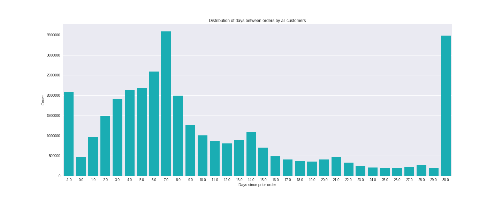
This graph shows that the number of products that people order are higher in the begining of the week. 
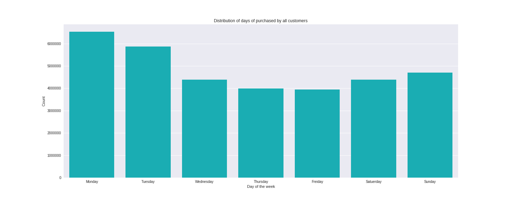
This picture shows that customer put their orders between 10 am - 5 pm. 
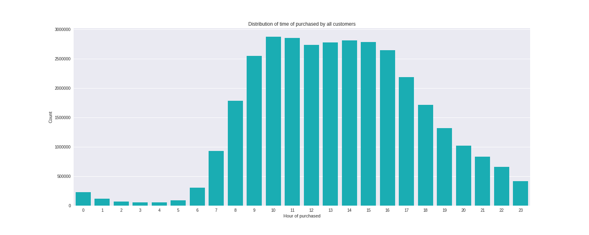

## Product related graphs

### Number of products
The distribution of product quantity ordered by customer is shown in two following pictures. These graphs are simillar. However, the second one is focused on products has focused on products with quantity less than 100. 
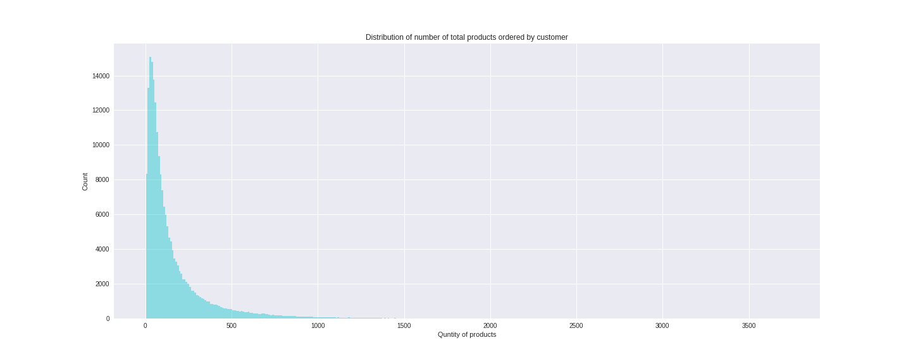
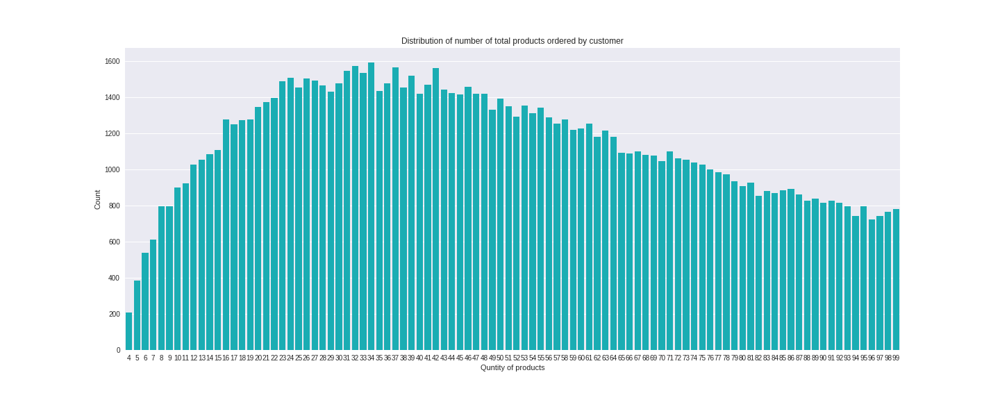

### All products, departments, aisles
Let see what products, departments and aisles are most popular? Here I only have taken first 20 popular items.  
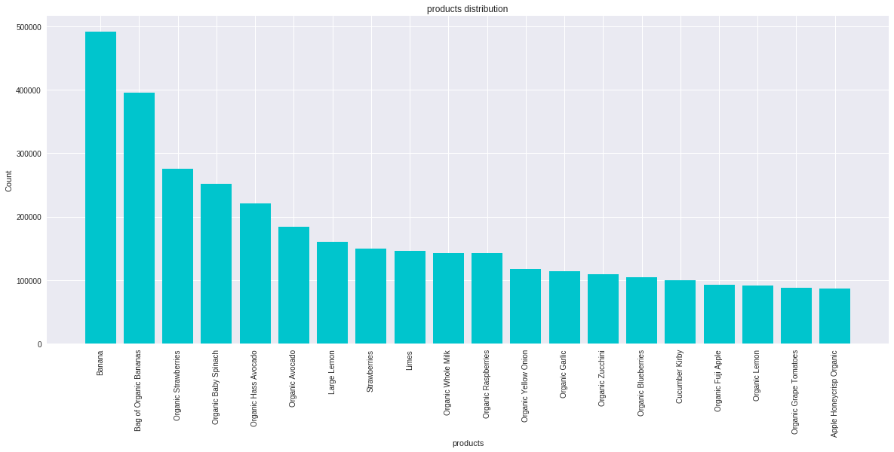
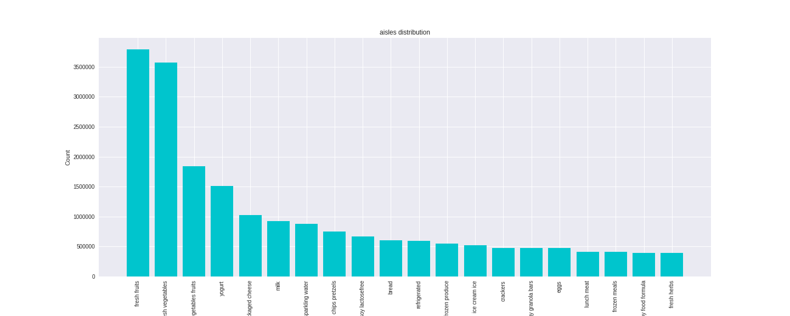
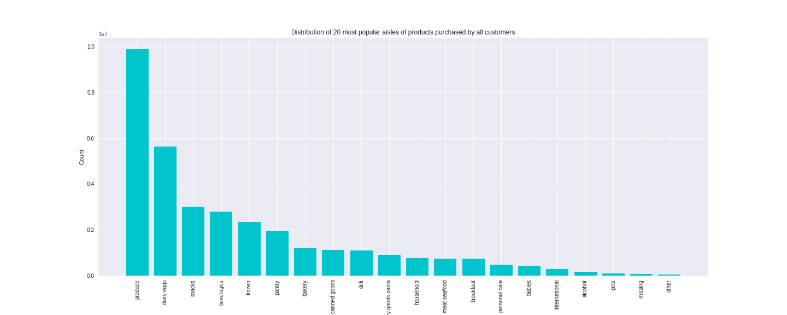
### First orders
I was curious how much products of new customer (in their first order) is different to general order. Comparing two bar charts from most popular products of all time and most popular pproducts in the first order may implay that they are almost similar. 
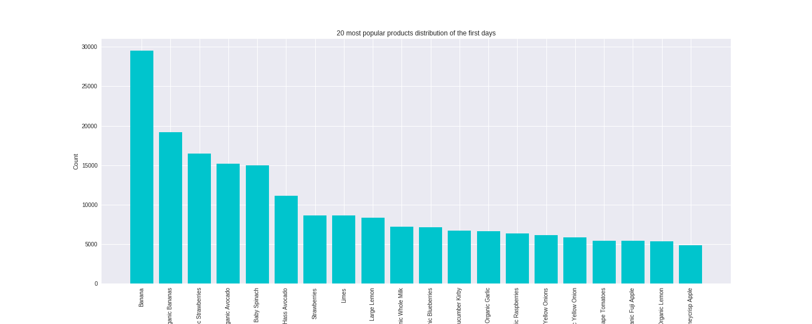

This comparision shows that the frequency of the order does not influence  very much on what people may order. As the following table shows products in different time of the purchased are the same with being in different ranking palce.

|Rank|First day|Weekly|Monthly|All time|
|---|---|---|---|---|
|1|Banana|Banana|Banana|Banana|
|2|Bag of Organic Bananas|Bag of Organic Bananas|Bag of Organic Bananas|Bag of Organic Bananas|
|3|Organic Strawberries|Organic Strawberries|Organic Baby Spinach|Organic Strawberries|
|4|Organic Avocado|Organic Baby Spinach|Organic Strawberries|Organic Baby Spinach|
|5|Organic Baby Spinach|Organic Hass Avocado|Large Lemon|Organic Hass Avocado|
|6|Organic Hass Avocado|Organic Avocado|Organic Hass Avocado|Organic Avocado|
|7|Strawberries|Large Lemon|Organic Avocado|Large Lemon|
|8|Limes|Strawberries|Strawberries|Strawberries|
|9|Large Lemon|Organic Whole Milk|Limes|Limes|
|10|Organic Whole Milk|Limes|Cucumber Kirby|Organic Whole Milk|
|11|Organic Blueberries|Organic Raspberries|Organic Yellow Onion|Organic Raspberries|
|12|Cucumber Kirby|Organic Yellow Onion|Organic Garlic|Organic Yellow Onion|
|13|Organic Garlic|Organic Fuji Apple|Organic Whole Milk|Organic Garlic|
|14|Organic Raspberries|Organic Zucchini|Organic Raspberries|Organic Zucchini|
|15|Yellow Onions|Organic Garlic|Organic Zucchini|Organic Blueberries|
|16|Organic Yellow Onion|Organic Blueberries|Organic Blueberries|Cucumber Kirby|
|17|Organic Grape Tomatoes|Cucumber Kirby|Organic Baby Carrots|Organic Fuji Apple|
|18|Organic Fuji Apple|Apple Honeycrisp Organic|Yellow Onions|Organic Lemon|
|19|Organic Lemon|Seedless Red Grapes|Sparkling Water Grapefruit|Organic Grape Tomatoes|
|20|Honeycrisp Apple|Organic Half & Half|Organic Fuji Apple|Apple Honeycrisp Organic

# The model
### User_item vector
To run the model, a vector including user and product ranking information is needed. 
The rating information has been calculated. Due to large number of products and users, the vector has been created as a sparse matrix. The columns are product_id and the rows are user_id. The values of the matrix are rating data. When a customer has ordered a product there is a non-zero value corresponding to that user row and product column. For example custome 1 had oreded product 10258 with rating of 91 and product 13032 with rating of 36. Values of the sparse matrix in row 1, column 10258 would be 91 and for row 1, column 13032 would be 36 and the rest would be zero.
The realted [code](../Capstone_project_2/Code/making_sparse.ipynb) generates a saprse matrix in npz format. 
This matrix can be seperated into two user and peroduct feature matrices as shown in this
*from https://s3-ap-south-1.amazonaws.com/av-blog-media/wp-content/uploads/2018/05/Matrix_factorization.png*.
## The model

The implicit model is applying Alternative Least Square (ALS) method combined with Cython and OpenMP to fit the models in parallel among all available CPU cores (please see Jess Wood weblog<a href="#note6" id="note6ref"><sup>6</sup> </a>). This method is much faster than normal ALS mothod. Implicit package was originally developed by [Ben Frederickson](https://github.com/benfred/implicit). In this method the relationship between user feature matrix and product feature matrix will be obtained by defining a feature weight matrix. Please see [matrix factorization]( https://www.analyticsvidhya.com/blog/2018/06/comprehensive-guide-recommendation-engine-python/) for more details. 
A model based on implict colaborative filtering was developed and can be found in this [code](../Capstone_project_2/Code/Implicit_collab_filtering.ipynb).

## The result and the evaluation
Here we don't have a specific tset set to evalute the result. Therefore,a test set was made. %20 of the infomation in user-product matrix were removed delibartly to make a training set and construct a test data set. The mean [AUC](http://scikit-learn.org/stable/modules/generated/sklearn.metrics.roc_auc_score.html) (area under curve) was calculated to assess the model. Overall, the model presents about %96 mean AUC. 

### An exaple
In the table below, products ordered by customer #5 and suggested products have been shown in two columns. SSUggested products are based other people rating. 
The cusotmer # 5 have ordered products below:
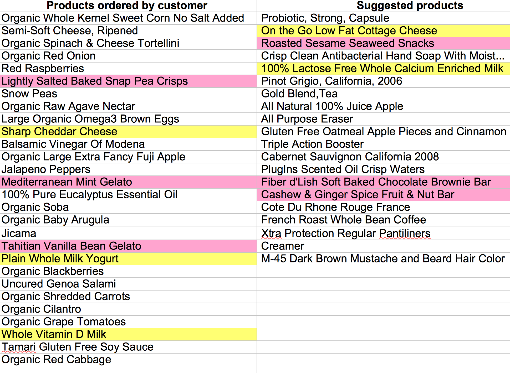

# Refferences
<a id="note1" href="#note1ref"><sup>1</sup></a>https://en.wikipedia.org/wiki/Instacart

<a id="note2" href="#note2ref"><sup>2</sup></a>https://www.kaggle.com/c/instacart-market-basket-analysis

<a id="note3" href="#note3ref"><sup>3</sup></a>https://en.wikipedia.org/wiki/Recommender_system

<a id="note4" href="#note4ref"><sup>4</sup></a>https://medium.com/recombee-blog/machine-learning-for-recommender-systems-part-1-algorithms-evaluation-and-cold-start-6f696683d0ed

<a id="note5" href="#note5ref"><sup>5</sup></a>https://www.analyticsvidhya.com/blog/2018/06/comprehensive-guide-recommendation-engine-python/

<a id="note6" href="#note6ref"><sup>6</sup></a>https://jessesw.com/Rec-System/

