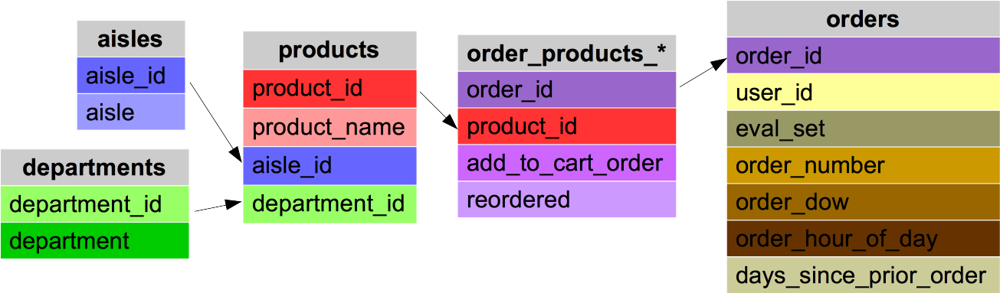

## The project

### What is Instacart?

InstaCart is an american company which provide personal shopping services from different shops and retailers such as WholeFoods and Costco to its customers<a href="#note1" id="note1ref">1</a>. People can order their groceries via the Instacart app and the website
https://www.instacart.com/ . After selecting products through the Instacart app, personal shoppers review your order and do the in-store shopping and delivery for you. 

### The competition
Instacart would like to predict the contents of future orders, such as how many products and  what products people will order. This idea was introduced as a challenge in the kaggle website in 2017 <a href="#note2" id="note2ref">2</a>. The project asks to predict what products will be ordered by customers.

## Recommendation system
It has worth to be mentioned that every customer has few orders while each order belongs to only one customer. This indicates that the problem is about predict the future customer orders rather than predicting products in each order. This is more like recommending products that you can see all in e-shopping website such as Amazon. The general method is called recommender system as part of information filtering system <a href="#note3" id="note3ref">3,  </a><a href="#note4" id="note4ref">4</a>. 

One of well-used recommendation system is collaborative filtering<a href="#note5" id="note5ref">5</a>. This method is based on an assumption that users who have a taste will act according to other people with the same preference.  To explain it simpler, one may say products which have been purchased by a some people with a similar preference so far, are most likely to be ordered by other people who have similar opinion about products. 
More information can be found in [collaborative filtering wikipage](https://en.wikipedia.org/wiki/Collaborative_filtering). In this model we need to know the preference of the every customer or in other word how customer incline toward every product. In may websites like Netflix and  Amazon, people asked to put their review and their rating for the product they have used. These information will be used to recommend more product to customers based on their rating. 

:point_up:But there are some real problem, first of all every day there will be more new customers. These customers don't have any rating information in the dataset. Second, there are lots of products which people do not rate at all. Some people even do not rate anything even they have used them. In some cases, like here ( please check the [data](#Data) section), there is no information about customers preference at all, except people order history.  The lack of rating data can be rectified by implicit collaborative filtering. In this project I have used an approach from [Jesse Wood website](https://jessesw.com/Rec-System/). 

## Data
Original data have been downoaded from [kaggle instacart competition website](https://www.kaggle.com/c/instacart-market-basket-analysis/data). The provided data included are the history of customer purchases. Generally, the records of ordered have been grouped into prior purchases, records which have been selected to be in train data set and records which have been selected to be predicted. These data are presented in cvs format as follow:

|File Name | Description | Size | Features |
|---|---|---|---|
|aisles|Information about the aisle of the products|134x2, 2.2+ KB |aisle_id, aisle|
|departments|Information about the department of the products|21x2, 416.0+ bytes|department_id, department|
|order_products_prior|Information of customer order history|32434489x4, 989.8 MB |order_id, product_id, add_to_cart_order, reordered |
|order_products_train|Information of customer order history|1384617x4, 42.3 MB |order_id, product_id, add_to_cart_order, reordered |
|orders|Information of orders |3421083x7, 182.7+ MB |order_id, user_id, eval_set, order_number, order_dow, order_hour_of_day, days_since_prior_order |
|products|Information about products|49688x4, 1.5+ MB |product_id, product_name, aisle_id, department_id|

<figure>
 
 <figcaption>the data </figcaption>
</figure>

### Feature description
 
- aisle_id: The code of each aisle
- aisle: The name of the aisle
- department_id: The code of departments
- department: The name of departments
- order_id: The code if orders
- product_id: The code of products
- add_to_cart_order: Indicates that a products has been added to current cart or not
- reordered: Indicates that the customer has a previous order that contains the product
- user_id: the code for each customer
- eval_set: Contains prior, train and test. It  indicates if the entry is from previous order or it has to be predicted. The test entries will be remove from taring model. 
- order_number: Indicates that that particular order is nth order of that particular customer
- order_dow: Indicates that order had been put in what day of the week
- order_hour_of_day: The hour of the order
- days_since_prior_order: Indicates there are how many days since previous order of each customer
- product_name: The name of the products
### Dealing with the size of data
The data were larger than my laptop can handle. One solution was to use cloud servers such as [google colaboratory](https://colab.research.google.com/notebooks/welcome.ipynb#recent=true). It provides a free Jupyter notebook running on cloud. In this service you have option to use a CPU accelerator or a GPU accelerator one. The GPU accelerator was used in this project.

### Rating 
Implicit collaborative filtering
- how many products a customer have ordered in total?
- How many times a product has been ordered by a customer?
- How many unique products a customer has ordered?

### Data wrnagling
## Extra information
# Data visualazation
# The model
## Clustering
## Colaborative filtering
# The result
## evaluation
# Refferences
<a id="note1" href="#note1ref">1</a>https://en.wikipedia.org/wiki/Instacart

<a id="note2" href="#note2ref">2</a>https://www.kaggle.com/c/instacart-market-basket-analysis

<a id="note3" href="#note3ref">3</a>https://en.wikipedia.org/wiki/Recommender_system

<a id="note4" href="#note4ref">4</a>https://medium.com/recombee-blog/machine-learning-for-recommender-systems-part-1-algorithms-evaluation-and-cold-start-6f696683d0ed

<a id="note5" href="#note5ref">5</a>https://www.analyticsvidhya.com/blog/2018/06/comprehensive-guide-recommendation-engine-python/
